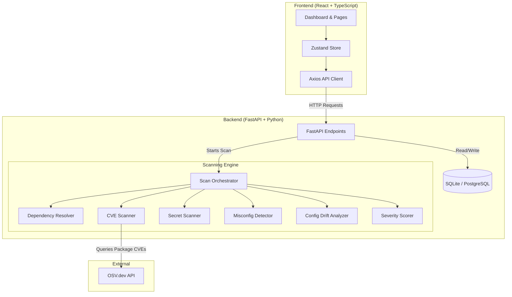

# 🦉 SovaScan

> **Intelligent Dependency, Configuration, and Secrets Security Analyzer tailored for Financial & Banking Codebases.**

[](https://fastapi.tiangolo.com/)
[](https://reactjs.org/)
[](https://www.typescriptlang.org/)
[](https://www.python.org/)
[](LICENSE)

SovaScan is an enterprise-grade security scanner designed to find, score, and remediate vulnerabilities in modern application codebases. Built with a focus on compliance-driven security, SovaScan automatically maps scanned vulnerabilities directly onto key regulatory frameworks like the **NIST Cybersecurity Framework (NIST-CSF)**, **SOC-2 Type II**, and **OWASP Top 10**.

---

## 🚀 Key Features

* 🔍 **Multi-Vector Scanning**:
  * **Dependency Analysis**: Scans manifest files (`package.json`, `requirements.txt`, `pom.xml`) and queries the open-source vulnerability database (**OSV API**) for CVEs.
  * **Secret Detection**: High-entropy Shannon algorithm combined with regex signatures to locate exposed API keys, private keys, and passwords.
  * **Misconfiguration Audit**: Inspects Dockerfiles, Nginx configurations, and environment configurations for wildcard CORS, running as root, and insecure TLS configurations.
  * **Configuration Drift**: Analyzes deployment baselines to identify drifts from secure standards.
* ⚖️ **Context-Aware Severity Scoring**:
  * Automatically calculates risk using modifiers (e.g. elevates score if found in production configurations, decreases score for test directories).
* 📋 **Compliance Regulatory Mapping**:
  * Seamlessly maps repository findings onto control categories for **NIST-CSF**, **SOC-2**, and **OWASP-10**, outputting interactive, auditable checklists.
* 💻 **Interactive Developer Dashboard**:
  * Clean, dark-themed React + TS frontend dashboard with charts, paginated findings explorer, live scan executor, and compliance health trackers.
* 🛠️ **Command-Line Interface (CLI)**:
  * Click-based CLI that prints rich, colorized terminal reports, generates CycloneDX SBOMs, or outputs JSON/SARIF.

---

## 🏗️ System Architecture



---

## 🛠️ Tech Stack

* **Frontend**: React 18, TypeScript, Zustand (State Management), Recharts (Visualizations), Vite (Build System), Vanilla CSS Custom Properties.
* **Backend**: FastAPI, SQLAlchemy (ORM), Pydantic v2 (Data Validation), Click (CLI Builder), Rich (Terminal Formatting).
* **Database**: SQLite (Default/Dev), supports PostgreSQL (Production).
* **Containerization**: Docker, Docker Compose.

---

## ⚡ Quick Start

The quickest way to run the entire SovaScan stack is using **Docker Compose**.

### Running with Docker Compose

1. **Clone the repository**:
   ```bash
   git clone https://github.com/abhinavsingh2403/SovaScan.git
   cd SovaScan
   ```

2. **Boot the stack**:
   ```bash
   docker-compose up --build
   ```

3. **Access the application**:
   * **Frontend Dashboard**: `http://localhost:8000/`
   * **Backend API Docs (Swagger)**: `http://localhost:8000/docs`

---

## 🔧 Manual Installation & Setup

If you prefer to run the components locally for development, follow the guides below.

### Backend Setup

1. **Navigate to backend and create virtual environment**:
   ```bash
   cd backend
   python -m venv .venv
   ```

2. **Activate the virtual environment**:
   * **Windows (PowerShell)**: `.venv\Scripts\Activate.ps1`
   * **Linux/macOS**: `source .venv/bin/activate`

3. **Install dependencies in development mode**:
   ```bash
   pip install -r requirements.txt
   pip install -e .
   ```

4. **Run the FastAPI server**:
   ```bash
   python -m uvicorn sovascan.server:app --reload --host 0.0.0.0 --port 8000
   ```

### Frontend Setup

1. **Navigate to the frontend directory**:
   ```bash
   cd ../frontend
   ```

2. **Install Node modules**:
   ```bash
   npm install
   ```

3. **Launch the development server** (Optional — only if developing with hot-reloading):
   ```bash
   npm run dev
   ```
   *Otherwise, build the frontend once using `npm run build`. The FastAPI server will serve the compiled React dashboard directly on `http://localhost:8000/`.*

---

## ⌨️ Command Line Interface (CLI)

SovaScan comes packaged with a command-line script. Once the backend is installed in development mode (`pip install -e .`), run it from anywhere in your terminal.

```bash
# Scan a directory target and output a colorized terminal table
sovascan scan C:\path\to\your\project

# Run scan and export output as a standalone HTML report
sovascan scan C:\path\to\your\project --format html --output report.html

# Generate a CycloneDX Software Bill of Materials (SBOM)
sovascan sbom C:\path\to\your\project --format json --output sbom.json
```

---

## 📈 Future Milestones & Roadmap

See [ROADMAP.md](ROADMAP.md) for full implementation tasks. Outstanding high-priority upgrades:
* 🔄 **Asynchronous Tasks**: Deploy Celery & Redis to move scans off the API thread.
* 💬 **WebSocket Streaming**: Stream live scan phases and percentages from the backend to the frontend UI.
* 🤖 **AI-Agent Auto-Fix**: Connect the `/fix/{finding_id}` endpoint to an LLM agent (like Gemini) to output and write precise git patches directly to files.

---

## 📝 Recent Integration Updates (Abhinav-v2)

All hardcoded mock data in the React frontend has been successfully removed and aligned with the FastAPI backend. Key improvements implemented in this release include:

* **Backend-Frontend API Integration**:
  * Connected frontend state actions directly to backend endpoints (`GET /scan`, `GET /findings`, `GET /dashboard/summary`, `GET /compliance/{framework}`, `POST /scan`, and `POST /fix/{id}`).
  * Created data adapters to recursively translate backend `snake_case` models to frontend `camelCase` interfaces.
  * Replaced simulated mock states with actual database queries.
* **Hourly Trend & Timezone Calibration**:
  * Configured security trend aggregation to group findings on an hourly basis.
  * **Timezone Offset Fix**: Utilized SQLite's `"localtime"` modifier inside the query `strftime` function so that data-point timestamps correctly reflect the user's local timezone (IST) instead of defaulting to naive UTC.
  * Formatted chart labels in `Dashboard.tsx` to display in a clean, short `HH:00` format.
* **Regex Engine & Rules Audit**:
  * Fixed a syntax error in the `SOVA-INFRA-001` Dockerfile rule (`container-root.yaml`) where the leading `^(?i)` flag mismatch crashed the Python regex engine.
  * Removed redundant `(?i)` modifiers across all 11 YAML rules since the engines already enforce `re.IGNORECASE` globally.
* **Scan Progress Bar & UI Polish**:
  * Removed the fake interpolated findings count during the folder scan animation, displaying `0` until the actual scanner returns.
  * Formatted chart structures and added loading spin states to the Compliance page.

---

## 📄 License

Distributed under the **MIT License**. See [LICENSE](LICENSE) for details.
