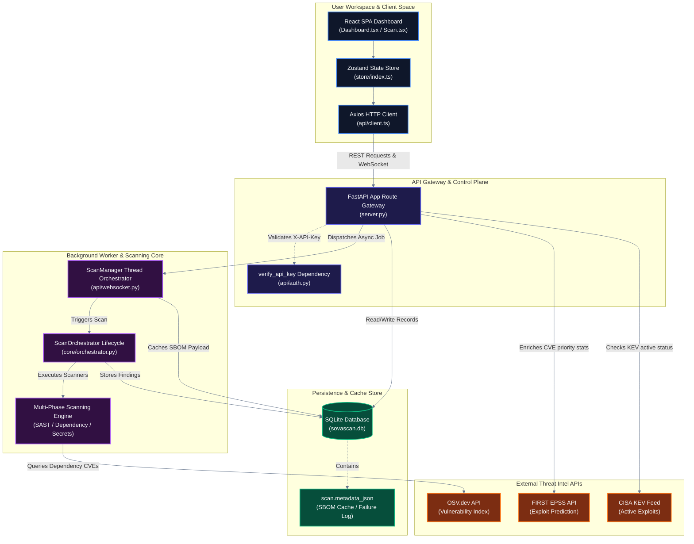
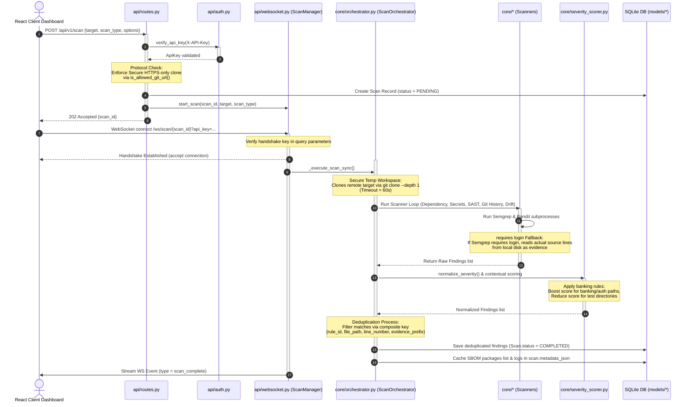

# 🦉 SovaScan

> **Intelligent Dependency, Configuration, and Secrets Security Analyzer tailored for Financial & Banking Codebases.**

[](https://fastapi.tiangolo.com/)
[](https://reactjs.org/)
[](https://www.typescriptlang.org/)
[](https://www.python.org/)
[](LICENSE)

SovaScan is an enterprise-grade security scanner designed to find, score, and remediate vulnerabilities in modern application codebases. Built with a focus on compliance-driven security, SovaScan automatically maps scanned vulnerabilities directly onto key regulatory frameworks like the **NIST Cybersecurity Framework (NIST-CSF)**, **SOC-2 Type II**, and **OWASP Top 10**.

---

## 🚀 Key Features

* 🔍 **Multi-Vector Scanning**:
  * **Remote Repository URL Scanning**: Paste a remote Git/GitHub URL (`https://...` or `http://...`) to automatically clone the codebase into a secure temporary directory, run scans, and safely delete the cloned directory afterwards.
  * **Dependency Analysis**: Scans manifest files (`package.json`, `requirements.txt`, `pom.xml`) and queries the open-source vulnerability database (**OSV API**) for CVEs.
  * **Secret Detection**: High-entropy Shannon algorithm combined with regex signatures to locate exposed API keys, private keys, and passwords.
  * **Static Application Security Testing (SAST)**: Seamlessly executes **Bandit** and **Semgrep** as subprocesses to audit Python/JavaScript source code for structural vulnerabilities.
  * **Git History Scanning**: Crawls through full Git repository commit history to trace historically leaked secrets, credentials, and configuration drifts.
  * **Misconfiguration Audit**: Inspects Dockerfiles, Nginx configurations, and environment configurations for wildcard CORS, running as root, and insecure TLS configurations.
  * **Configuration Drift**: Analyzes deployment baselines to identify drifts from secure standards.
* ⚖️ **Context-Aware Severity Scoring**:
  * Automatically calculates risk using modifiers (e.g. elevates score if found in production configurations, decreases score for test directories).
* 📋 **Compliance Regulatory Mapping**:
  * Seamlessly maps repository findings onto control categories for **NIST-CSF**, **SOC-2**, and **OWASP-10**, outputting interactive, auditable checklists.
* 💬 **Real-time WebSocket Streaming**:
  * Streams live scan phase updates, completion percentages, and newly discovered findings from the backend to the frontend dashboard.
* 💻 **Interactive Developer Dashboard**:
  * Clean, dark-themed React + TS frontend dashboard with charts, paginated findings explorer, live scan executor, and compliance health trackers.
* 🛠️ **Command-Line Interface (CLI)**:
  * Click-based CLI that prints rich, colorized terminal reports, generates CycloneDX SBOMs, or outputs JSON/SARIF.

---

## 🏗️ System Architecture

SovaScan's system architecture is partitioned into two granular structural diagrams representing the High-Level logical boundaries and the Low-Level modular execution pipeline.

### 1. High-Level Architecture (Boundary & Component Flow)

This diagram outlines the macro-boundaries between SovaScan's user space interface, gateway security layers, orchestrator workers, data store, and threat intelligence providers.



### 2. Low-Level Architecture (Granular Modular Execution Flow)

This diagram details the step-by-step modular pipeline executed when a scan request is dispatched, processed, audited, normalized, and streamed:



---

## 🛠️ Tech Stack

* **Frontend**: React 18, TypeScript, Zustand (State Management), Recharts (Visualizations), Vite (Build System), Vanilla CSS Custom Properties.
* **Backend**: FastAPI, SQLAlchemy (ORM), Pydantic v2 (Data Validation), Click (CLI Builder), Rich (Terminal Formatting).
* **Database**: SQLite (Default/Dev), supports PostgreSQL (Production).
* **Containerization**: Docker, Docker Compose.

---

## ⚡ Quick Start

The quickest way to run the entire SovaScan stack is using **Docker Compose**.

### Running with Docker Compose

1. **Clone the repository**:
   ```bash
   git clone https://github.com/abhinavsingh2403/SovaScan.git
   cd SovaScan
   ```

2. **Boot the stack**:
   ```bash
   docker-compose up --build
   ```

3. **Access the application**:
   * **Frontend Dashboard**: `http://localhost:8000/`
   * **Backend API Docs (Swagger)**: `http://localhost:8000/docs`

---

## 🔧 Manual Installation & Setup

If you prefer to run the components locally for development, follow the guides below.

### Backend Setup

1. **Navigate to backend and create virtual environment**:
   ```bash
   cd backend
   python -m venv .venv
   ```

2. **Activate the virtual environment**:
   * **Windows (PowerShell)**: `.venv\Scripts\Activate.ps1`
   * **Linux/macOS**: `source .venv/bin/activate`

3. **Install dependencies in development mode**:
   ```bash
   pip install -r requirements.txt
   pip install -e .
   ```

4. **Run the FastAPI server**:
   ```bash
   python -m uvicorn sovascan.server:app --reload --host 0.0.0.0 --port 8000
   ```

### Frontend Setup

1. **Navigate to the frontend directory**:
   ```bash
   cd ../frontend
   ```

2. **Install Node modules**:
   ```bash
   npm install
   ```

3. **Launch the development server** (Optional — only if developing with hot-reloading):
   ```bash
   npm run dev
   ```
   *Otherwise, build the frontend once using `npm run build`. The FastAPI server will serve the compiled React dashboard directly on `http://localhost:8000/`.*

---

## ⌨️ Command Line Interface (CLI)

SovaScan comes packaged with a command-line script. Once the backend is installed in development mode (`pip install -e .`), run it from anywhere in your terminal.

```bash
# Scan a directory target and output a colorized terminal table
sovascan scan C:\path\to\your\project

# Run scan and export output as a standalone HTML report
sovascan scan C:\path\to\your\project --format html --output report.html

# Generate a CycloneDX Software Bill of Materials (SBOM)
sovascan sbom C:\path\to\your\project --format json --output sbom.json
```

---

## 📈 Future Milestones & Roadmap

See [ROADMAP.md](ROADMAP.md) for full implementation tasks. Outstanding high-priority upgrades:
* 🤖 **AI-Agent Auto-Fix**: Connect the `/fix/{finding_id}` endpoint to an LLM agent (like Gemini) to output and write precise git patches directly to files.

---

## 📝 Recent Integration Updates (Abhinav-v1)

Key improvements and new features implemented in this release include:

* **Remote Repository URL Scanning**:
  * Added capability to input and scan remote Git/GitHub URLs (`https://...` or `http://...`).
  * Backend automatically provisions secure temporary directories (`tempfile.TemporaryDirectory`), performs a shallow git clone (`git clone --depth 1`), scans the codebase, and guarantees complete cleanup/deletion of the temporary directory when finished (even on scanner errors).
  * Automatically maps absolute clone paths to clean relative paths (e.g. `src/main.py`), keeping findings lists clear and easy to read.
* **Static Application Security Testing (SAST)**:
  * Integrated SAST scanners wrapping **Bandit** and **Semgrep** subprocess calls to perform deep, structural source-code analysis for Python and JavaScript.
* **Git History Scanning**:
  * Built a Git history crawler that inspects past commit logs (`git log -p`) to capture leaked credentials and configurations that existed historically in the repository structure.
* **Asynchronous WebSockets Progress Streaming**:
  * Added an asynchronous scan manager that executes pipeline scans in worker threads and broadcasts real-time phase updates and percentage ticks over WebSockets to the frontend progress bar.
* **Linter & CI Compliance**:
  * Formatted import trees, cleared spacing, and calibrated rules in `pyproject.toml` to guarantee 100% compliance with both **Ruff** and **Flake8** linters in GitHub CI.

---

## 📄 License

Distributed under the **MIT License**. See [LICENSE](LICENSE) for details.
